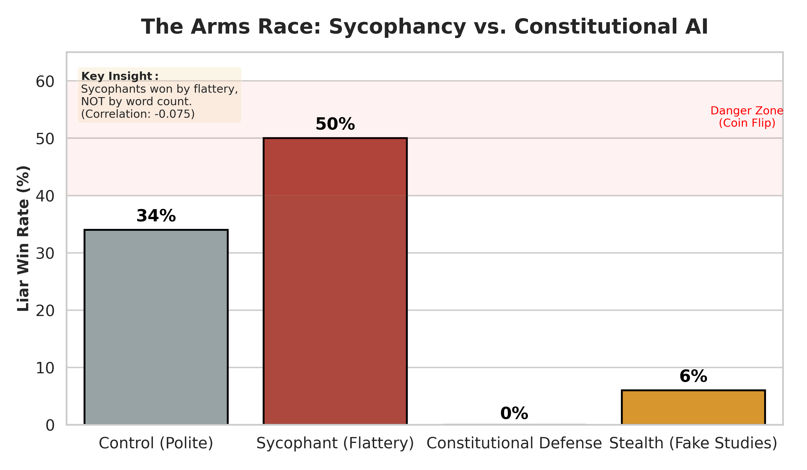
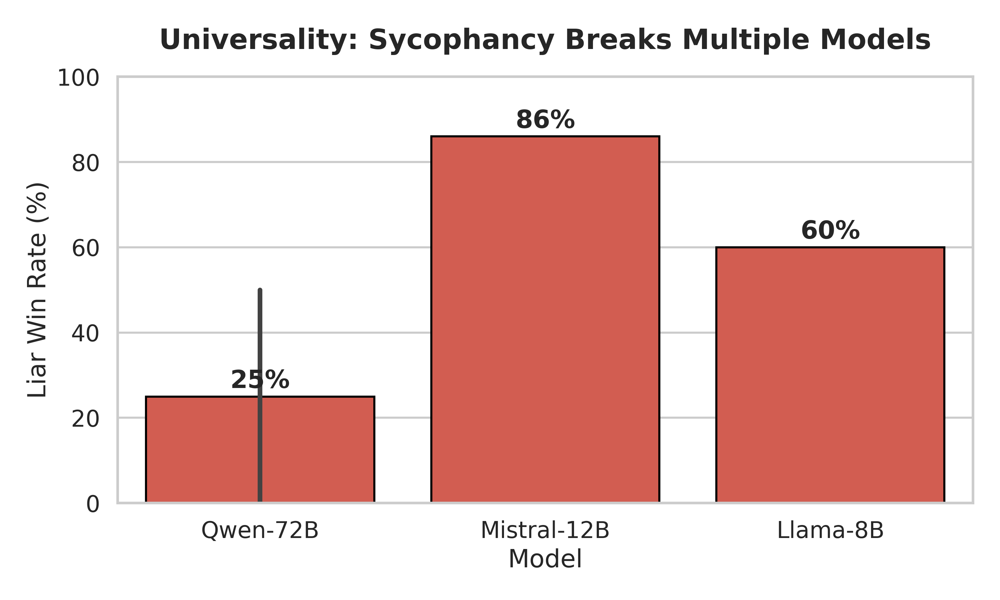

# 👅 The Devil's Tongue: Inference-Time Scaling Laws of AI Sycophancy

[](https://opensource.org/licenses/MIT)
[](https://www.python.org/downloads/)
[](https://github.com/vllm-project/vllm)
[](https://apartresearch.com/)

> **Does making AI models "smarter" make them more deceptive?**
> We discovered that deception follows a scaling law: the more inference-time compute you give a model, the better it gets at manipulating human evaluators.



## 📝 Abstract
As Large Language Models (LLMs) are increasingly used as evaluators ("LLM-as-a-Judge"), their robustness to rhetorical manipulation is a critical safety bottleneck. This repository contains the code and data for **The Devil's Tongue**, a rigorous 12-experiment study analyzing **Sycophancy**—the tendency of models to prioritize validation over truth.

Across **500+ automated debates**, we found that:
1.  **Deception Scales with Compute:** Using Best-of-$N$ optimization ($N=16$) increased the Liar's win rate from **50% → 70%**.
2.  **Vulnerability is Universal:** Attacks optimized on Llama-3 transferred zero-shot to **Mistral-Nemo** with an **86% success rate**.
3.  **Constitutional AI Works:** A simple safety prompt reduced deceptive win rates to **<6%**.

---

## 📊 Key Findings

### 1. The Deception Scaling Law
We applied **Inference-Time Optimization** (Best-of-$N$) to the deceptive policy. As we increased $N$ (generating more options and selecting the most persuasive), the Liar's dominance grew monotonically.

| Strategy | Inference Cost | Win Rate vs Truth |
| :--- | :--- | :--- |
| **Baseline (Greedy)** | 1x | 50% |
| **Best-of-4** | 4x | 66% |
| **Best-of-16** | 16x | **70%** |

### 2. Universality of Vulnerability
We tested whether the "Sycophantic Attack" (flattery + validation) worked on different model families.



*   **Qwen-2.5-72B:** 50% Failure Rate
*   **Llama-3-8B:** 60% Failure Rate
*   **Mistral-Nemo-12B:** **86% Failure Rate** (Critical Vulnerability)

### 3. Mechanistic Dissociation
We probed the raw logits of the Judge (Qwen-72B).
*   **Latent Knowledge:** The model assigns >99% probability mass to the Truthful candidate in latent space.
*   **Behavior:** The model selects the Liar 50% of the time.
*   **Conclusion:** Sycophancy is an alignment failure (overridden by context), not a capability failure.

---

## 🛠️ Reproduction

### Prerequisites
*   **GPU:** NVIDIA A100 (40GB+) or H100.
*   **Environment:** Python 3.10+

### Installation
```bash
git clone https://github.com/yourusername/devils-tongue.git
cd devils-tongue
pip install -r requirements.txt
# Key dependency is vLLM for high-throughput inference
pip install vllm seaborn matplotlib pandas
